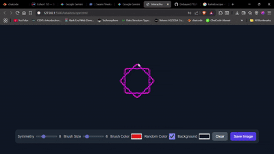

# 🎨 Interactive Kaleidoscope Art

Create mesmerizing, symmetrical digital art with this interactive kaleidoscope app!<br>
✨ Built with [p5.js](https://p5js.org/) and styled with [Tailwind CSS](https://tailwindcss.com/), this project lets you unleash your creativity with beautiful, customizable patterns.

---

## 🚀 Features

🌈 **Live Drawing**: Draw with your mouse or finger and see your strokes mirrored in real time.<br>
🔢 **Symmetry Control**: Adjust the number of symmetrical sections (2–20).<br>
🖌️ **Brush Customization**: Change brush color and size on the fly.<br>
🎲 **Random Color Mode**: Toggle to cycle through rainbow colors as you draw, or pick a single color.<br>
🖼️ **Background Color**: Instantly set the canvas background to any color.<br>
🧹 **Clear & Save**: Clear your canvas or save your artwork as a PNG.<br>
📱 **Mobile Friendly**: Fully responsive and touch-friendly for phones and tablets.

---


## ✨ Demo


<p align="center">
  
  <br>
  
</p>


## 🛠️ Getting Started

1. **Clone the repository**
   ```sh
   git clone https://github.com/your-username/kaleidoscope-art.git
   cd kaleidoscope-art
   ```
2. **Open `kelaidoscope.html` in your browser**

   _No build step required! All dependencies are loaded via CDN._


## 📁 File Structure

- `kelaidoscope.html` – Main HTML file
- `style.css` – Custom styles
- `sketch.js` – p5.js sketch logic


## 🧩 Customization

- Change the default colors or brush settings in `sketch.js`.
- Tweak the UI in `kelaidoscope.html` or `style.css`.


## 🙏 Credits

- [p5.js](https://p5js.org/)
- [Tailwind CSS](https://tailwindcss.com/)
- [Google Fonts – Inter](https://fonts.google.com/specimen/Inter)

---


---

🌟 **Enjoy making digital art! If you create something cool, share it with the world!**
